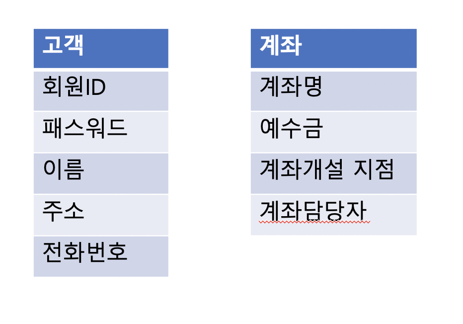

# SQL D 개발자 개념 정리

## 데이터 모델링

### Point 3 엔터티(Entity)
1. 엔터티(Entity)
    * 업무에서 관리해야 하는 데이터 집합을 의미
    * 저장되고 관리되어야 하는 데이터
    * 엔티티는 개념, 사건, 장소 등의 명사이다.

2. 엔터티(Entity) 도출
    * 비즈니스 프로세스에서 관리되어야 하는 정보를 추출해야 한다.
    * 비즈니스 프로세스 엔티티 도출 예시 
        1. 고객이 회원가입을 한다. 회원으로 가입할 때는 회원 ID, 패스워드, 이름, 주소, 전화번호 등을 입력해야 한다.
        2. 회원으로 가입하기 위해서는 반드시 하나의 계좌를 개설해야 한다.
        3. 고객은 계좌를 여러 개 개설할 수 있다.
        4. 계좌를 개설할 떄는 계좌번호, 계좌명, 예수금, 계좌 개설 지점, 계좌 담당자가 입력된다.
    
        

3. 엔터티(Entity) 특징  
  
    | 엔터티 특징 | 설명 |
    | --- | --- |
    | `식별자` | - 엔티티는 유일한 식별자가 있어야 한다.   - 회원 ID, 계좌번호 |
    | `인스턴스 집합` | - 2개 이상의 인스터스가 있어야 한다. |
    | `속성` | - 엔터티는 반드시 속성을 가지고 있다. |
    | `관계` | - 엔터티는 다른 엔티티와 최소 한 개 이상 관계가 있어야 한다. |
    | `업무` | - 엔티티는 업무에서 관리되어야 하는 집합이다. |

4. 엔터티(Entity) 종류
    1. 유형과 무형 엔티티  

        | 종류 | 설명 |
        | --- | --- |
        | `유형 엔티티` | - 업무에서 도출되면 지속적으로 사용되는 엔티티   - 고객, 강사, 사원 |
        | `개념 엔티티` | - 유형 엔티티는 물리적 형태가 있지만, 개념 엔터티는 물리적 형태가 없다.   - 개념적으로 사용되는 엔터티이다.   - 거래소 종목, 코스닥 종목, 생명보험 상품 |
        | `사건 엔티티` | - 비즈니스 프로세스를 실행하면서 생성되는 엔티티   - 주문, 체결, 취소주문, 수수료 청구 등 |
    
    2. 발생시점에 따른 엔티티의 종류  
    
        | 종류 | 설명 |
        | --- | --- |
        | `기본 엔터티` | - 키 엔터티, 다른 엔터티로부터 영향을 받지 않고 독립적으로 생성되는 엔터티 |
        | `중심 엔터티` | - 기본 엔터티와 행위 엔터티 간의 중간에 있는 것   - 기본 엔티티로부터 발생되고 행위 엔터티를 생성하는 것 |
        | `행위 엔터티` | - 2개 이상의 엔터티로부터 발생됨 | 

### Point 4 속성(Attribute)
1. 속성
    * 엔티티가 가지고 있는 업무에서 필요한 정보
    * 더 이상 분리되지 않는 단위

2. 속성의 특징
    * 업무에서 관리되는 정보
    * 하나의 값만 가짐
    * 주식별자에게 함수적으로 종속, 키본키가 변경되면 속성의 값도 변경됨

### Point 5 관계(Relationship)
