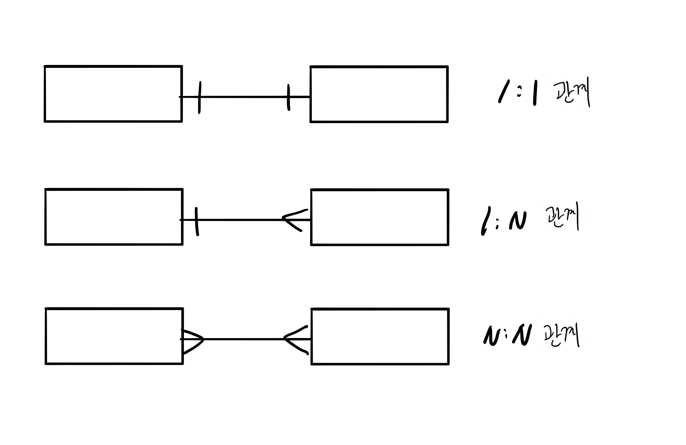
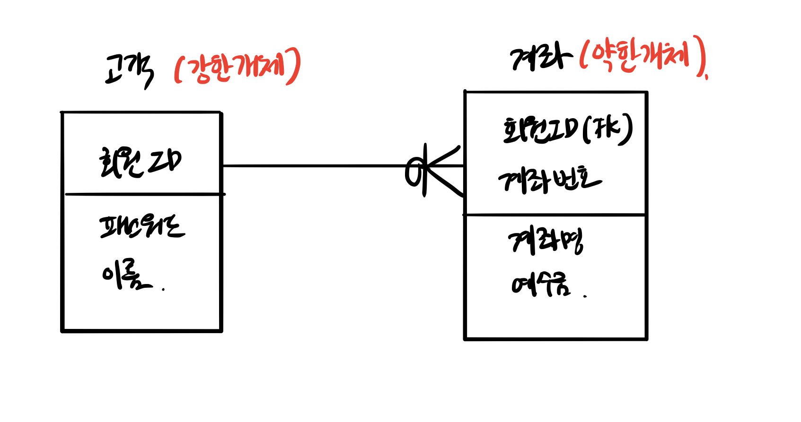
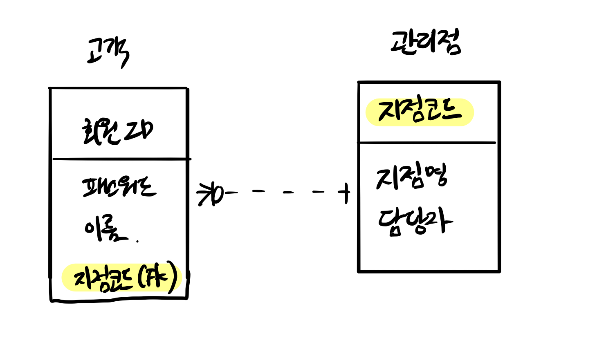

# 데이터 모델링

## 목차

- [3층 스키마(3-Level Schema)](#Point-2-3층-스키마)
- [엔터티(Entity)](#Point-3-엔터티)
- [속성(Attribute)](#Point-4-속성)
- [관계(Relationship)](#Point-5-관계)
- [엔터티 식별자(Entity Identifier)](#Point-6-엔터티-식별자)
### Point 2 3층 스키마
1. 3층 스키마(3-Level Schema)
    * 사용자, 설계자, 개발자가 DB를 보는 관점에 따라 DB를 기술하고 이들간의 관계를 정의한 ANSI 표준
    * 3층 스키마는 DB의 독립성을 확보하기 위한 방법이다.
    * 데이터의 독립성을 확보하면 데이터 복잡도 증가, 데이터 중복 제거, 사용자 요구사항 변경에 따른 대응력 향상, 관리 및 유지보수 비용 절감 등의 장점을 갖는다.
    * 3단계 계층으로 분리해서 독립성을 확보하는 방법으로 각 계층을 View라고도 한다.
    * **3층 스키마의 독립성**
    
        | 독립성 | 설명 |
        | --- | --- |
        | `논리적 독립성` | 저장구조가 변경되어도 응용 프로그램 및 개념 스키마에 영향이 없다. |
        | `물리적 독립성` | DB 논리적 구조가 변경되어도 응용 프로그램에 변화가 없다. |

2. 3층 스키마 구조

    
    | 구조 | 설명 |
    | --- | --- |
    | `외부 스키마(External Schema)` | - 사용자 관점, 업무상 관련이 있는 데이터 접근이다.   - 관련 데이터베이스의 뷰(View)를 표시한다.   - **응용 프로그램이 접근하는 데이터베이스**를 정의한다. |
    | `개념 스키마(Conceptual Schema)` | - 설계자 관점, 사용자 전체 집단의 데이터베이스 구조이다.   - 전체 DB 내의 규칙과 구조를 표현한다.   - **통합 데이터베이스 구조**이다. |
    | `내부 스키마(Internal Schema)` | - 개발자 관점, DB의 **물리적 저정구조**이다.   - 데이터 저장구조, 레코드 구조, 필드 정의, 인덱스 등을 의미한다. | 

### Point 3 엔터티
1. 엔터티(Entity)
    * 업무에서 관리해야 하는 데이터 집합을 의미
    * 저장되고 관리되어야 하는 데이터
    * 엔티티는 개념, 사건, 장소 등의 명사이다.

2. 엔터티(Entity) 도출
    * 비즈니스 프로세스에서 관리되어야 하는 정보를 추출해야 한다.
    * 비즈니스 프로세스 엔티티 도출 예시 
        1. 고객이 회원가입을 한다. 회원으로 가입할 때는 회원 ID, 패스워드, 이름, 주소, 전화번호 등을 입력해야 한다.
        2. 회원으로 가입하기 위해서는 반드시 하나의 계좌를 개설해야 한다.
        3. 고객은 계좌를 여러 개 개설할 수 있다.
        4. 계좌를 개설할 떄는 계좌번호, 계좌명, 예수금, 계좌 개설 지점, 계좌 담당자가 입력된다.
    
        

3. 엔터티(Entity) 특징  
  
    | 엔터티 특징 | 설명 |
    | --- | --- |
    | `식별자` | - 엔티티는 유일한 식별자가 있어야 한다.   - 회원 ID, 계좌번호 |
    | `인스턴스 집합` | - 2개 이상의 인스터스가 있어야 한다. |
    | `속성` | - 엔터티는 반드시 속성을 가지고 있다. |
    | `관계` | - 엔터티는 다른 엔티티와 최소 한 개 이상 관계가 있어야 한다. |
    | `업무` | - 엔티티는 업무에서 관리되어야 하는 집합이다. |

4. 엔터티(Entity) 종류
    1. 유형과 무형 엔티티  

        | 종류 | 설명 |
        | --- | --- |
        | `유형 엔티티` | - 업무에서 도출되면 지속적으로 사용되는 엔티티   - 고객, 강사, 사원 |
        | `개념 엔티티` | - 유형 엔티티는 물리적 형태가 있지만, 개념 엔터티는 물리적 형태가 없다.   - 개념적으로 사용되는 엔터티이다.   - 거래소 종목, 코스닥 종목, 생명보험 상품 |
        | `사건 엔티티` | - 비즈니스 프로세스를 실행하면서 생성되는 엔티티   - 주문, 체결, 취소주문, 수수료 청구 등 |
    
    2. 발생시점에 따른 엔티티의 종류  

        | 종류 | 설명 |
        | --- | --- |
        | `기본 엔터티` | - 키 엔터티, 다른 엔터티로부터 영향을 받지 않고 독립적으로 생성되는 엔터티 |
        | `중심 엔터티` | - 기본 엔터티와 행위 엔터티 간의 중간에 있는 것   - 기본 엔티티로부터 발생되고 행위 엔터티를 생성하는 것 |
        | `행위 엔터티` | - 2개 이상의 엔터티로부터 발생됨 | 

### Point 4 속성
1. 속성
    * 엔티티가 가지고 있는 업무에서 필요한 정보
    * 더 이상 분리되지 않는 단위

2. 속성의 특징
    * 업무에서 관리되는 정보
    * 하나의 값만 가짐
    * 주식별자에게 함수적으로 종속, 키본키가 변경되면 속성의 값도 변경됨

### Point 5 관계
1. 관계
    * 엔티티 간의 관련성을 의미하며 존재 관계와 행위 관계로 분류
    * 존재 관계 : 두 개의 엔터티가 존재 여부의 관계가 있는 것
    * 행위 관계 : 두 개의 엔터티가 어떤 행위에 의한 관련성이 있는 것

2. 관계의 종류
    1. 존재 관게
        * 엔터티 간의 상태를 의미
        * 예) 고객이 은행에 회원가입을 하면, 관리점이 할당되고, 그 할당점으로 관리점에서 고객을 관리

    2. 행위 관계
        * 엔터티 간에 어떤 행위가 있는 것을 의미
        * 예) 증권회사에서 계좌를 사용해서 주문을 발주하는 관계가 만들어진다.
    
    3. 관계 차수
        1. 관계 차수
            * 두 개의 엔터티 간에 관계에 참여하는 수를 의미
            
        2. 관계 차수 종류
            * 1:1 관계
                * **완전 1:1 관계** : 하나의 엔티티에 관계되는 엔티티의 관계가 반드시 하나 존재하는 경우
                * **선택전 1:1 관계** : 하나의 엔티티에 관계되는 엔티티가 하나거나 없을 경우
            * 1:N 관계
                * 엔터티에 행이 하나 있을 떄 다른 엔터티의 값이 여러 개 있는 관계
            * M:N 관계
                * 두 개 엔터티가 서로 여러 개의 관계를 가지고 있는 것
                * 예) 한 명의 학생이 여러 개의 과목을 수강할 수 있다. 반대로 한 개의 과목은 여러 명의 학생이 수강할 수 있다.
                * 관계형 DB에서 M:N 관계의 조인은 카테시안 곱이 발생한다. 그래서 M:N 관계를 1:N, N:1로 해소해야 한다.
            * 필수적 관게와 선택적 관계
                * 필수적 관계는 반드시 하나는 존재해야 하는 관계이고, 선택적 관계는 없을 수도 있는 관계이다.
                * 필수적 관계는 '|'로 표현되고 선택적 관게는 'O'로 표현
        
    4. 식별 관계와 비식별 관계
        1. 식별 관계(Identification Relationship)
            * 고객과 계좌 엔터티에서 고객은 독립적으로 존재할 수 있는 강한 개체(String Entitiy)이다.
            * 강한 개체는 어떤 다른 엔터티에게 의존하지 않고 독립적으로 존재한다.
            * 강한 개체는 다른 엔터티와 관계를 가질 떄 다른 엔터티에게 기본키를 공유한다.
            * 강한 개체는 식별 관계로 표현된다.
            * **즉, 식별 관계란 고객 엔터티의 기본키인 회원ID를 계좌 엔터티의 기본키의 하나로 공유하는 것이다.**
            * 강한 개체의 기본키 값이 변경되면 식별 관계에 있는 엔터티의 값도 변경된다.
            * 여기서 계좌 엔터티는 약한 개체가 된다.
            * 식별 관계는 실선으로 표현한다.
            
            
        2. 비식별 관계(Non-Identification Relationship)
            * 강한 개체의 기본키를 다른 엔터티의 기본키가 아닌 일반 컬럼으로 관계를 가지는 것을 의미한다.
            * 예) 관리점 엔터티의 기본키인 지점 코드가 고객 엔터티의 일반 칼럼으로 참조되고 있다.
            * 비식별 관계는 점선으로 표현한다.
            
            
    ### Point 6 엔터티 식별자
    > 식별자라는 것은 엔터티를 대표할 수 있는 유일성을 만족하는 속성이다. 일반적으로 회원ID, 계좌번호, 주민등록번호, 외국인등록번호, 여권번호 등이 있다.

    1. 주식별자(기본키, Primary key)
        * 유일성과 최소성을 만족하는 키이다.
        * 엔터티를 대표할 수 있어야 한다.
        * 엔터티의 인스턴스를 유일하게 식별한다.
        * 자주 변경되지 않아야 한다.

        * **키의 종류**  

        | 데이터베이스 키 | 설명 |
        | --- | ---|
        | `기본키(Primary key)` | 후보키 중에서 엔터티를 대표할 수 있는 키이다. |
        | `후보키(CandidTe key)` | 후보키는 유일성과 최소성을 만족하는 키이다. |
        | `슈퍼키(Super key)` | 슈퍼키는 유일성은 만족하지만 최소성(Not Null)을 만족하지 않는 키이다. |
        | `대체키(Alternate key)` | 대체키는 여러 개의 후보키 중에서 기본키를 선정하고 남은 키이다. |

    2. 식별자의 종류
        * 식별자는 대표성, 생성 여부, 속성의 수, 대체 여부로 분류된다.

        1. 식별자의 대표성
            * 주식별자는 엔터티를 대표할 수 있는 식별자이다. 예를 들어 회원ID가 고객 엔터티에 주식별자가 된다.

            * **대표성 여부에 따른 식별자의 종류**

                | 종류 | 설명 |
                | --- | --- |
                | `주식별자` | - 유일성과 최소성을 만족하면서 **엔터티를 대표하는 식별자**이다.   - 다른 엔터티와 **참조 관계로 연결**될 수가 있다.|
                | `보조 식별자` | 유일성과 최소성은 만족하지만 **대표성을 만족하지 못하는 식별자**이다. |
        
        2. 생성 여부
            * **생성 여부에 따른 식별자의 종류**

                | 종류 | 설명 |
                | --- | --- |
                | `내부 식별자` | - 내부 식별자는 엔터티 내부에서 스스로 생성되는 식별자이다.   - 예) 고객 엔터티의 회원ID, 관리점의 지점코드 등 |
                | `외부 식별자` | - 다른 엔터티의 관계로 인하여 만들어지는 식별자이다.   - 계좌 엔터티의 회원ID 등 |

        3. 속성의 수
            * **속성의 수에 따른 식별자의 종류**

                | 종류 | 설명 |
                | --- | --- |
                | `단일 식별자` | - 하나의 속성으로 구성된다.   - 예) 고객 엔터티의 회원ID |
                | `복합 식별자` | - 두 개 이상의 속성으로 구성된다.   - 예) 계좌 엔터티의 회원ID와 계좌번호 |

        4. 대체 여부
            * **대체 여부에 따른 식별자의 종류**

                | 종류 | 설명 |
                | --- | --- |
                | `본질 식별자` | 비즈니스 프로세스에서 만들어지는 식별자이다. |
                | `인조 식별자` | 인위적으로 만들어지는 식별자이다. |

